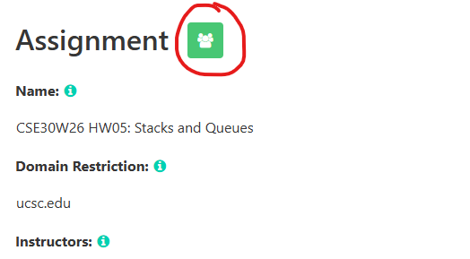
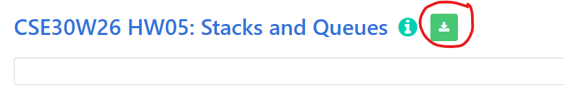
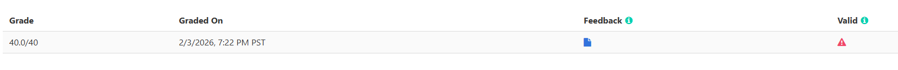
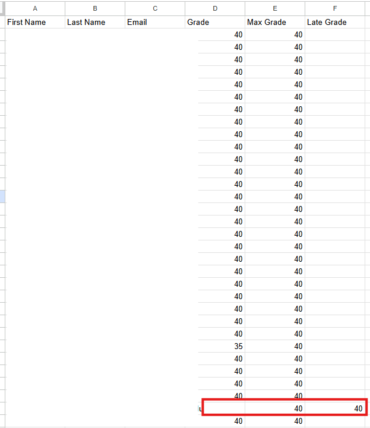
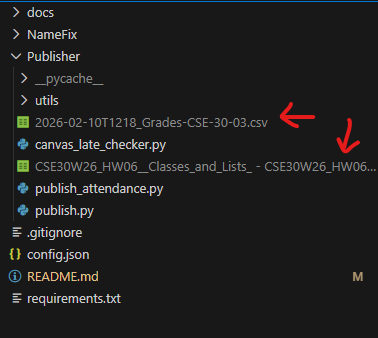

# Notebook to Canvas Grader

This program is designed to help instructors grade assignments from NotebookGrader and publish the grades to Canvas. The tool
processes a CSV file containing student grades and publishes them to the Canvas gradebook.

## Requirements

- **Python 3.x**
- Required Libraries:
    - `pyfiglet`
    - `argparse`
    - `requests`

You can install the required dependencies using the following command:

```bash
pip install -r requirements.txt
```

---

## Usage

### Preparing CSV Files

Before using the main program, you must update the notebookgrader CSV to include the Late Grades.

#### Steps to Prepare the CSV File:

1. **Download the CSV file from notebookgrader:**
    - Go to the assignment in NotebookGrader and click on the green people icon
    

    - Click the download button on the top to download the csv
    

    - Open the csv and add a `Late Grade` Column. Now, you will have to go to NotebookGrader and transfer all of the late (invalid) submissions to the Late Grade column. Late submission are marked by a red triangle in NotebookGrader, and clicking on the triangle will let you see that student's score.
    

      

    - Once you are done, download the updated excel sheet as a csv


2. **Download the CSV file from Canvas:**
    - Navigate to the **Canvas course** and click the **"Grades"** tab in the left sidebar.
      
    - Click the **"Export"** button in the top-right corner and select **"Export Entire Gradebook"** from the dropdown.
      
    - The file will be named with the current year. 


3. **Prepare the updated file:**
    - Move both Canvas and NotebookGrader files into the `Publisher` directory.
    

---

## Main Program: Canvas Publisher

### Config File (`config.json`)

To run the main program, a `config.json` file is required. This file contains the Canvas API access token, course ID, assignment name, and late token ID.

#### Steps to Create `config.json`:

1. **Get the Canvas API Access Token:**
    - Follow the
      instructions [here](https://community.canvaslms.com/t5/Canvas-Basics-Guide/How-do-I-manage-API-access-tokens-in-my-user-account/ta-p/615312).

2. **Get the Canvas Course ID:**
    - Refer to [this guide](https://13kb.helpscoutdocs.com/article/551-how-to-locate-canvas-course-and-section-id) to
      locate your course ID.

3. **Get the Assignment Name**:
    - This is just the name of the assignment as shown on Canvas.

4. **Get the Late Submission Tokens ID**:
    - Click on the assignment `Late Submission Tokens`
    - The url should look like: `canvas.ucsc.edu/courses/[courseID]/assignments/[assignment_id]`
    - The `assignment_id` should be a 6 digit number, this is the late submission token ID

5. **Edit `config.json`:**
    - Add the information as follows:

   ```json
   {
     "access_token": "your_canvas_access_token",
     "course_id": "your_course_id",
     "assignment_name": "name_of_assignment",
     "tokens_assignment_id": "tokens_id"
   }
   ```

4. Save the file in the root directory of the project.

---

### Running the Program

1. Navigate to the `Publisher` directory:

   ```bash
   cd Publisher
   ```

2. Identify the main Python files:
    - **`publish.py`:** Publishes grades to Canvas (main program).

___
4. **Run the main program:**

   ```bash
   python publish.py
   ```
    - Review the output to ensure grades are successfully updated.
      


## Output

The program may generate errors if:

- The assignment name is not found in Canvas.
- The CSV file is missing or improperly formatted.
- A student is not found in the Canvas course.
- Grades fail to update.

---

## Author

Created by Arthur Wei.
Additional changes added by Michelle Wan.

